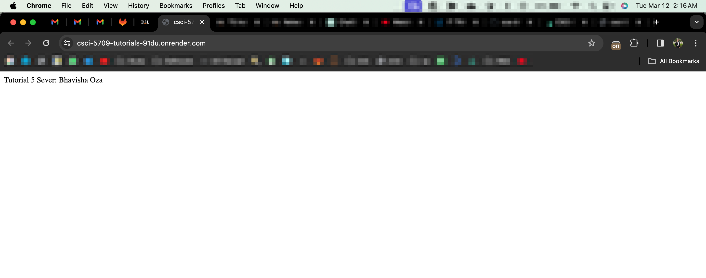

# Tutorial 5

## **Author**

Name: Bhavisha Oza \
Banner ID: B00935827 \
Email ID: bhavisha.oza@dal.ca \
Date Created: 11 March 2024 \
Last Modification Date: 12 March 2024

## Tutorial APIs Deployed URL

- <https://csci-5709-tutorials-91du.onrender.com>

## GitLab URL

- <https://git.cs.dal.ca/boza/csci-5709-tutorials/-/tree/main/Tutorial5?ref_type=heads>

## Deployment

Project was deployed using Render and live on the mentioned [link](https://csci-5709-tutorials-91du.onrender.com/)


### Deployment Steps

- Start build with `node server.js`

## Built With

- [Node JS](https://nodejs.org/docs/latest/api/)
- [Express JS](https://expressjs.com/en/starter/installing.html)

## API Endpoint

The project uses the following API endpoint:

- Fetch all users: Get Request: https://csci-5709-tutorials-91du.onrender.com/users
- Add a new user: Put Request: https://csci-5709-tutorials-91du.onrender.com/update/:id
- Update an existing user: Post Request: https://csci-5709-tutorials-91du.onrender.com/add
- Fetch a single user by ID: Get Request: https://csci-5709-tutorials-91du.onrender.com/user/:id

## Sources Used

### `server.js`

- This file is built using the Express.js framework. URL: [https://expressjs.com/](https://expressjs.com/)

Line 10-20 and 50-57

```
app.get("/", (req, res) => {
  res.send("Tutorial 5 Sever: Bhavisha Oza");
});

app.get("/users", (req, res) => {
  res.json({
    message: "Users retrieved",
    success: true,
    users,
  });
});
```

```
app.get("/user/:id", (req, res) => {
  const { id } = req.params;
  const user = users.find((u) => u.id === id);
  if (!user) {
    return res.status(404).json({ message: "User not found", success: false });
  }
  res.json({ success: true, user });
});

```

The above lines were created by adapting the code in [EXPRESS Routing](https://expressjs.com/en/guide/routing.html) as shown below:

```
app.get('/example/b', (req, res, next) => {
  console.log('the response will be sent by the next function ...')
  next()
}, (req, res) => {
  res.send('Hello from B!')
})
```

Line 22-34

```
app.put("/update/:id", (req, res) => {
  const { id } = req.params;
  const { email, firstName } = req.body;
  const user = users.find((u) => u.id === id);
  if (!user) {
    return res.status(404).json({ message: "User not found", success: false });
  }

  if (email) user.email = email;
  if (firstName) user.firstName = firstName;

  res.json({ message: "User updated", success: true });
});
```

The above lines were created by adapting the code in [EXPRESS Application properties](https://expressjs.com/en/5x/api.html#app.put.method) as shown below:

```
app.put('/', (req, res) => {
  res.send('PUT request to homepage')
})

```

Line 36-48

```
app.post("/add", (req, res) => {
  const { email, firstName } = req.body;
  const newUser = {
    id: Date.now().toString(),
    email,
    firstName,
  };
  users.push(newUser);
  res.json({
    message: "User added",
    success: true,
  });
});
```

The above lines were created by adapting the code in [EXPRESS Application properties](https://expressjs.com/en/5x/api.html#app.post.method) as shown below:

```
app.post('/', (req, res) => {
  res.send('POST request to homepage')
})

```

## Additional Notes

- I've used the code shown in the tutorial video for GET API.
